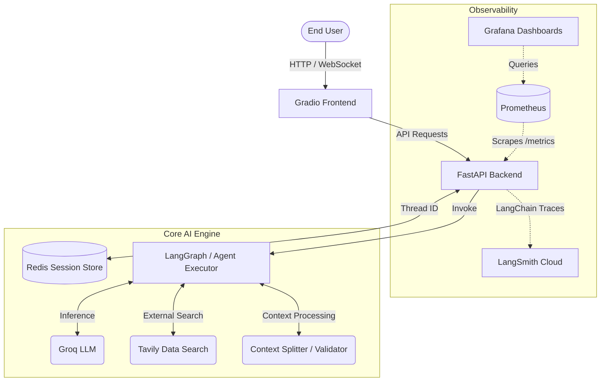

<div align="center">
  <h1>Context-Aware Enterprise Conversational Agent</h1>
  <p><strong>A Production-Grade, Observable, and Scalable AI Architecture</strong></p>

  <p>
    <a href="https://www.python.org/downloads/release/python-3100/"></a>
    <a href="https://fastapi.tiangolo.com/"></a>
    <a href="https://www.docker.com/"></a>
    <a href="https://opensource.org/licenses/MIT"></a>
  </p>
</div>

<br />

## Table of Contents
- [Executive Summary](#executive-summary)
- [Enterprise Architecture](#enterprise-architecture)
- [Dual-Layer Observability](#dual-layer-observability)
- [Core Technologies](#core-technologies)
- [Directory Structure](#directory-structure)
- [Deployment & Installation](#deployment--installation)
- [Environment Configuration Matrix](#environment-configuration-matrix)
- [Agent Workflow Execution](#agent-workflow-execution)
- [Testing & Quality Assurance](#testing--quality-assurance)
- [License & Contributions](#license--contributions)

---

## Executive Summary

Building an LLM-powered agent for enterprise applications requires moving beyond mere API wrappers. It demands deterministic state management, rigorous observability, and decoupled microservices to handle concurrent asynchronous workloads gracefully. 

The **Context-Aware Enterprise Agent** is a highly scalable **V3 Architecture** leveraging **FastAPI** for low-latency backend operations, **Gradio** for real-time streaming interfaces, and a dedicated **Redis** cluster for instantaneous memory orchestration. It is built to maintain context intelligently across prolonged sessions without breaching token limits.

---

## Enterprise Architecture

The architecture relies on strict separation of concerns, decoupling the presentation layer from the cognitive engine.



### Component Breakdown:
1. **Frontend (UI Layer):** Driven by Gradio and mounted dynamically onto the FastAPI application pipeline to minimize network hops. It consumes Server-Sent Events (SSE) for continuous token streaming.
2. **Backend (API Layer):** Built on ASGI (FastAPI), providing robust asynchronous throughput. It natively handles external ingress, webhook routing, and exposes a `/metrics` telemetry endpoint.
3. **Agent Orchestrator (Cognitive Layer):** Implements dynamic cyclical graph resolution using LangChain alongside Groq's high-speed inference endpoints. It autonomously assesses domain logic and dynamically invokes integrated tools based on user intent.
4. **Memory Engine (State Layer):** Conversations are inherently stateful. A Redis container maintains thread integrity, indexing conversation history while autonomously summarizing contexts that threaten to breach the LLM's maximum token capacity.

---

## Dual-Layer Observability

To ensure a highly reliable production environment, system monitoring is split into two specialized, non-overlapping domains:

### 1. Cognitive & LLM Tracing (LangSmith)
**Scope: The "Brain" of the AI.**
LangSmith is integrated natively into the execution graph to monitor the internal decision-making processes of the LLM:
- **Execution Tracing:** Every inference, prompt payload, and external tool call is logged.
- **Cost Economics:** Granular visibility into token throughput and exact API call costs.
- **Agent Logic Debugging:** Immediate identification of hallucinations, contextual drift, or faulty tool selections.

### 2. Infrastructural Health (Grafana & Prometheus)
**Scope: The "Body" of the System.**
Grafana provides real-time analytical dashboards fueled by Prometheus time-series metrics scraped directly from the FastAPI backend and Redis nodes:
- **System Metrics:** Docker container CPU utilization, memory thresholds, and network I/O.
- **API Performance:** HTTP request rates (RPS), endpoint latencies (P99, P95 metrics), and 4xx/5xx error anomalies.
- **Concurrency Tracking:** Active session counts and asynchronous thread loads within the Python Event Loop.

---

## Core Technologies

<div align="center">
  
  
  
  
  
  
  
  
  
  
  
</div>

---

## Directory Structure

Strict architectural modularity is enforced. The repository categorizes domain logic, infrastructural routes, and UI segments distinctly:

```text
Context-Aware-Conversational-Agent/
├── agent/
│   ├── __init__.py
│   └── agent_runner.py          # Core LangChain/Groq orchestration and tool binding
├── api/
│   ├── memory_manager.py        # Asynchronous Redis IO and context synthesis
│   └── server.py                # FastAPI ASGI application and Gradio mounting
├── core/
│   ├── __init__.py
│   └── config.py                # Pydantic BaseSettings for immutable environments
├── prompts/                     # Static system instructions and contextual templates
├── tools/                       # External API tools (Tavily search, context validators)
├── ui/                          # Gradio interface schemas and state handlers
├── tests/                       # Unit and integration CI/CD test suites
├── docker-compose.yml           # Multi-container cluster orchestration
├── prometheus.yml               # Scraper configuration for endpoint telemetry
├── dockerfile                   # Isolated application container definition
├── main.py                      # Uvicorn entry point
└── requirements.txt             # Strict dependency locking
```

---

## Deployment & Installation

### Option A: Fully Containerized Deployment (Recommended)

1. **Verify Prerequisites:**
   Ensure [Docker Engine](https://docs.docker.com/engine/) and [Docker Compose](https://docs.docker.com/compose/) are installed.

2. **Clone and Configure:**
   ```bash
   git clone <repository_url>
   cd Context-Aware-Conversational-Agent
   # Create and populate the .env file (See Environment Configuration Matrix below)
   ```

3. **Orchestrate the Cluster:**
   Execute the orchestration manifest to inherently resolve project dependencies and construct isolated network bridges:
   ```bash
   docker-compose up --build -d
   ```

4. **Verify Access Vectors:**
   - **Interactive Console (UI):** `http://localhost:7860`
   - **FastAPI Documentation (Swagger UI):** `http://localhost:7860/docs`
   - **Grafana Dashboards:** `http://localhost:3000` *(Default: admin/admin)*
   - **Prometheus Targets:** `http://localhost:9090`

### Option B: Local Bare-Metal Execution

If you prefer avoiding Docker for rapid local development:

1. **Install Dependencies:**
   ```bash
   python -m venv venv
   source venv/bin/activate  # On Windows: venv\Scripts\activate
   pip install -r requirements.txt
   ```
2. **Initialize Local Redis:** (Requires a local Redis server running on port 6379)
3. **Boot the Application:**
   ```bash
   python main.py
   ```

---

## Environment Configuration Matrix

The application expects a `.env` file at the root level. All keys are validated strictly by the Pydantic `core/config.py` settings module at runtime.

| Variable | Description | Required | Example |
|----------|-------------|:--------:|---------|
| `REDIS_URL` | Redis connection string for the memory engine. | Yes | `redis://agent_redis:6379/0` |
| `GROQ_API_KEY` | Authentication token for the Groq inference engine. | Yes | `gsk_...` |
| `TAVILY_API_KEY` | Token for external web search capabilities. | Yes | `tvly-...` |
| `LANGCHAIN_TRACING_V2` | Boolean flag to enable/disable LangSmith telemetry. | No  | `true` |
| `LANGCHAIN_ENDPOINT` | LangSmith ingestion API endpoint. | No  | `https://api.smith.langchain.com` |
| `LANGCHAIN_API_KEY` | Authentication token for LangSmith dashboard. | No  | `lsv2_...` |
| `LANGCHAIN_PROJECT` | Telemetry grouping tag displayed in LangSmith UI. | No  | `Enterprise-Agent-V1` |

---

## Agent Workflow Execution

When a user submits a query via the UI, the exact pipeline is as follows:
1. **Ingress:** The Gradio WebSocket captures the input and relays it concurrently to the asynchronous FastAPI endpoint.
2. **Memory Retrieval:** The `AsyncRedisSessionManager` fetches the historical thread (up to the token limit) referencing the unique `session_id`.
3. **Graph Evaluation:** The LangChain agent evaluates the input against the historical context. If external knowledge is required, it dynamically invokes the `WebSearchTool` (Tavily).
4. **Validation:** If the data requires summarization or relevance checks, supplementary tools (`ContextRelevanceCheckerTool`) validate the payload.
5. **Streaming Synthesis:** The LLM streams the finalized token response back through the ASGI layer to the UI in real time.
6. **State Persistence:** A background daemon thread captures the completed exchange, compresses it if necessary, and rewrites the optimized state packet back to the Redis cluster.

---

## Testing & Quality Assurance

Code quality and regression checking are paramount. Ensure the Docker container is actively running, then execute the remote testing suite:

```bash
docker exec -it context_aware_ui pytest tests/ -v --disable-warnings
```
This triggers unit and integration tests covering context splitting, web search parsing, and memory management edge cases.

---

## License & Contributions

This software is distributed under the proprietary stipulations of its corresponding authors, or under the **MIT License** where explicitly applicable.

Contributions must adhere strictly to established architectural diagrams. Adherence to rigorous PEP-8 linting paradigms, strict type-hinting methodologies (`mypy`), and test coverage bounds (`pytest-cov`) is absolutely mandatory for any prospective downstream merges.